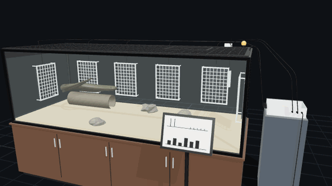
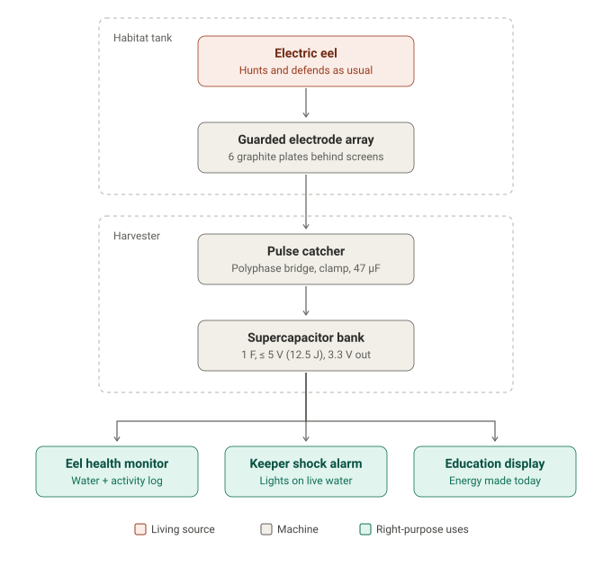
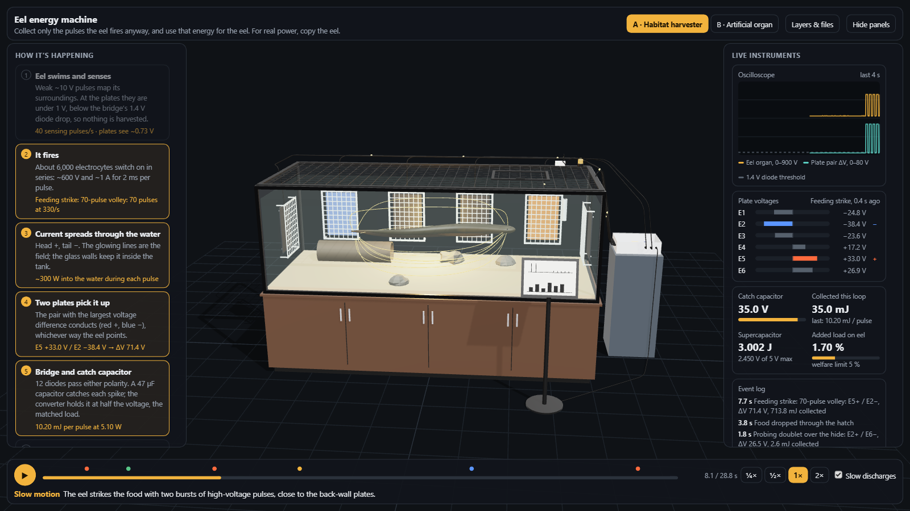
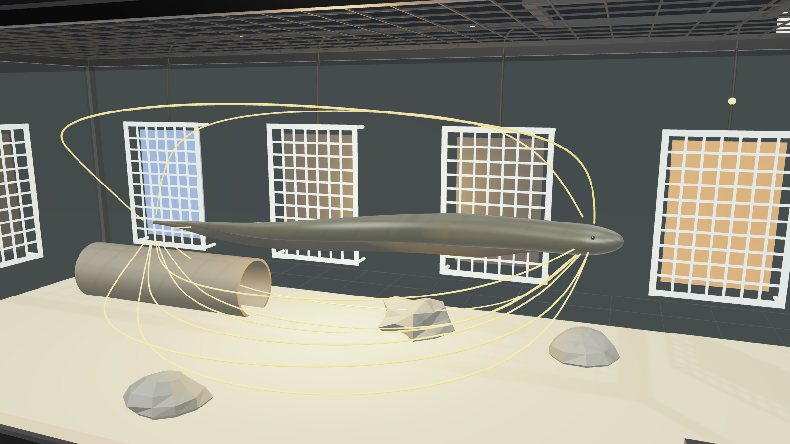
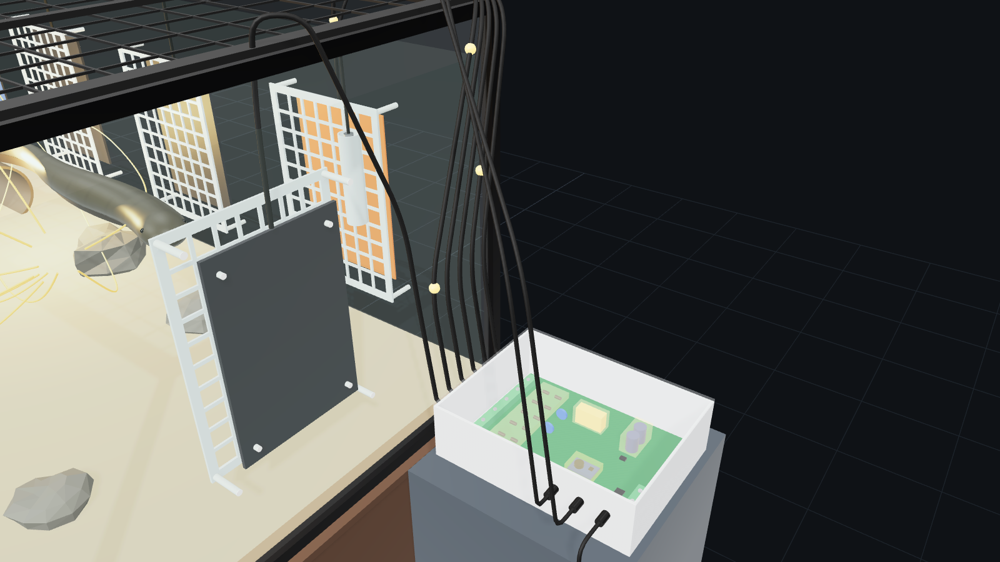

# Energy extraction from electric eels, used for the right purposes

A machine design with **animated 3D models** that open in any 3D program, plus the engineering behind them.



An electric eel can fire up to **860 V**, but each pulse lasts only about **2 ms**. Wall electrodes in its tank collect about **0.1 J a day**, so one eel would need about a thousand years to charge a phone. Taking more would mean provoking the animal, and that is cruel. The design therefore has two parts:

| | Part A: passive habitat harvester | Part B: artificial electric organ |
|---|---|---|
| Idea | Collect only the pulses the eel fires anyway | Copy the eel's cells in hydrogel instead of using the eel |
| Output | Microwatts, event-driven | Volts from salt gradients, scalable |
| Used for | Keeper shock alarm, eel health log, education display | Implants without battery-replacement surgery, soft robots, blue energy |
| Model | [`models/eel-habitat-harvester.*`](models) | [`models/artificial-electric-organ.*`](models) |

Read the full design, with the energy derivations, electronics, bill of materials, welfare rules and references, in **[docs/DESIGN.md](docs/DESIGN.md)**.



## What the animation shows

The habitat model holds one **28.8-second loop** that packs a day's highlights together. The eel swims a path around the tank. Its body follows its head, it ripples with a travelling wave, and it rises to gulp air, as electric eels must. At three moments it fires, and each discharge is computed, not just drawn:

| Time | What the eel does | Plates that conduct | ΔV between them | Energy collected per pulse |
|---|---|---|---|---|
| 1.8 s | Probing doublet over the hide (2 pulses) | E2 + / E6 − | 26 V | 1.3 mJ |
| 7.7 s | Feeding strike: 70-pulse volley in two bursts | E5 + / E2 − | 71 V | 10.2 mJ |
| 27.1 s | Probing doublet near the end wall (2 pulses) | E1 + / E6 − | 51 V | 5.2 mJ |

The weak ~10 V sensing pulses it fires while cruising give only 0.7 V at the plates. That is below the bridge's 1.4 V diode drop, so they can't be harvested at all.

For every discharge you can watch the energy's path:

1. The **field lines** flash from the eel's head (+) to its tail (−).
2. The **conducting pair of plates** glows: red for +, blue for −.
3. **Energy dots** run along the two live leads into the harvester. Real current is instant; the dots are slowed so you can follow them.
4. The **bridge, catch capacitor, converter and supercapacitor** light up in turn.
5. The **alarm beacon** flashes, the **monitor LED** logs the event, and after the feeding strike the **e-paper display** refreshes with the new waveform.

The physics behind each frame comes from the same code that builds the model. The eel is treated as a head/tail current dipole in water of conductivity 0.01 S/m, and the six insulating tank walls are modelled as mirrors (the method of images). That gives each plate's voltage and, from those, the matched-load energy. All of it is saved in [`models/eel-habitat-harvester.timeline.json`](models/eel-habitat-harvester.timeline.json).

Part B animates too: Na⁺ ions cross the cation membrane one way and Cl⁻ ions cross the anion membrane the other way, together making one current.

## The viewer and its panels



Open `index.html` through any static server, or enable GitHub Pages for this repo. The viewer has:

- **How it's happening.** Seven steps, from "Eel swims and senses" to "Put to the right use". Each one lights up while it is happening, with live numbers such as the conducting plates, ΔV, energy per pulse and energy stored.
- **Live instruments.** An oscilloscope of the eel's voltage and the plate-pair ΔV against the 1.4 V diode threshold. Voltage bars for all six plates with the + and − pair marked. Gauges for the catch capacitor and supercapacitor, the energy collected this loop, and the added load on the eel against the 5% welfare limit. An event log.
- **Transport.** Play/pause, a scrubber with event markers, speeds from ¼× to 2×, and automatic slow motion during discharges. A caption narrates what is happening.
- **Part B panels.** A five-step explanation of the gel battery and a stack calculator: drag the number of cells and see the voltage and stack length.
- **Hover any part** to read its description. Use **Layers & files** to toggle parts and download any format.

## 3D models

Each model is exported in three formats so that anything can open it:

| File | Format | Opens in | Notes |
|---|---|---|---|
| `*.glb` | glTF 2.0 binary, **animated** | Blender, Unity, Unreal, Godot, three.js / Babylon.js, Windows 3D Viewer, KeyShot, online glTF viewers | Rigged eel (24-joint skin) and one looping clip with 100 channels: swimming, field flashes, plate glows, energy dots, harvester stages, beacon, display, food. PBR materials, named hierarchy, a description on every part (`extras.description`). Passes the Khronos glTF Validator with 0 errors, 0 warnings, 0 hints |
| `*.obj` + `*.mtl` | Wavefront OBJ | Practically every 3D program: Maya, 3ds Max, Cinema 4D, SketchUp, Rhino, MeshLab… | One frozen moment, mid feeding strike. One named object per part with colours, emission and opacity |
| `*.stl` | Binary STL | Slicers (Cura, PrusaSlicer), CAD (Fusion, SolidWorks, FreeCAD), and **GitHub's built-in 3D preview** (click the file) | The same frozen moment. Single colour, **millimetres, +Z up**, opaque parts only (glass, water, field lines and glows left out so you can see inside) |

GLB and OBJ use **metres, +Y up**. The habitat model is 3.7 × 1.9 × 1.9 m including the pedestal and display. The organ model is 380 × 200 × 87 mm. In renderers that don't play animation, the GLB shows the same frozen moment as the OBJ.

| Eel and its discharge field | Energy reaching the harvester |
|---|---|
|  |  |
| **Whole habitat** | **Part B: artificial electric organ** |
|  |  |

### Quick start

- **Blender:** File → Import → glTF 2.0 → `models/eel-habitat-harvester.glb`, then press play in the Timeline. The water and glass are transparent; the field lines, plate glows and beacon glow.
- **Windows:** double-click the `.glb` file. 3D Viewer plays the animation.
- **Unity / Unreal / Godot:** import the `.glb` and play its one clip, "Swim and harvest (loop)".
- **Browser:** run `python -m http.server` in this folder and open `http://localhost:8000`.
- **Print or CAD:** use the `.stl` file.

## Regenerating the models

The models, the animation and the timeline are all generated from code. Every dimension, the swimming path and the electrical constants in [`tools/build_models.py`](tools/build_models.py) can be changed and rebuilt:

```bash
pip install numpy
python tools/build_models.py
```

The output is deterministic, so the same code always produces the same files.

## The rules built into this machine

1. **Passive only.** No prodding, baiting, stimulation, or feeding schedules changed to make the eel fire more.
2. **No added effort for the eel.** The harvester may add at most 5% to the eel's load. It adds about 0.1–0.5% mid-tank and up to ~2% when the eel fires right beside a plate.
3. **Welfare comes before output.** The health monitor runs on its own battery, so it never goes dark when a sick eel discharges less.
4. **No surgery, implants or restraint.** Only captive-bred or rescued eels in accredited facilities.
5. **No weapons or stunning devices.** The 3.3 V-only output and small energy store make that a hardware limit.

Energy figures are order-of-magnitude estimates with their assumptions stated in [DESIGN.md](docs/DESIGN.md). They should be refined with measurements from a real habitat.
