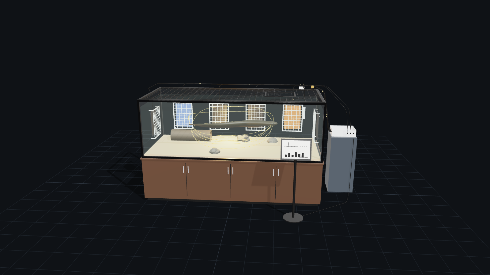
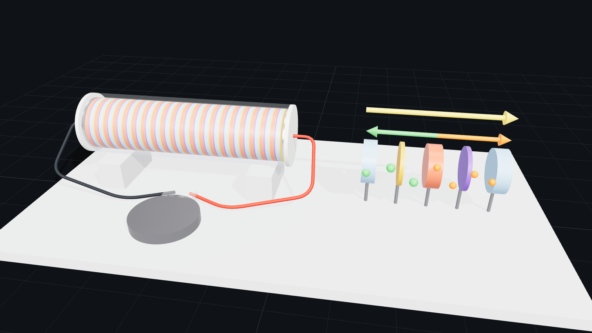

# Design: an electric-eel energy machine used for the right purposes

This document is the engineering design behind the 3D models in [`../models`](../models).
It has two parts:

- **Part A, the passive habitat harvester.** It collects a small share of the pulses an electric eel fires anyway, and spends that energy on keeper safety and teaching. It never stimulates the animal.
- **Part B, the artificial electric organ.** It copies the eel's electrocytes in hydrogel. This is the only route to useful amounts of power, and it needs no animal.

The numbers below are estimates accurate to about a factor of ten. Each one shows its assumption so it can be checked against real measurements.

---

## 1. The constraint that shapes everything

An electric eel's discharge is powerful but brief. One high-voltage pulse reaches hundreds of volts, but lasts only about 2 ms. Most of its energy heats the water right next to the eel. Getting a lot of energy out of an eel would mean provoking it to fire again and again. That is cruel, and the arithmetic below shows it still wouldn't give useful power.

So the design rule is: **collect passively, spend the energy on the eel's keepers and visitors, and get real power from biomimicry (copying how the eel works), not from the animal.**

## 2. The source

| Property | Value | Source / note |
|---|---|---|
| Electrocytes | ~6,000 in series, ~0.15 V each | Cells stacked along the body, like batteries in a torch |
| Peak organ voltage | up to 860 V (*E. voltai*); ~500–600 V other species | de Santana et al., 2019 |
| Pulse width | ~2 ms | High-voltage discharge |
| Volleys | up to ~400 pulses/s while hunting | Catania, 2014 |
| Polarity | head positive, tail negative | |
| Internal resistance, R_i | ~300 Ω (assumed) | To be measured during commissioning |

**Pulse energy.** Treat the eel as a voltage source V_e behind R_i, driving into the water.
The water's resistance between the head and tail regions is roughly that of two small electrodes in a large bath:

```
R_water ≈ (1 / 2πσ) · (1/a − 1/d)        a ≈ 0.05 m, d ≈ 1.5 m, σ ≈ 0.01 S/m (100 µS/cm)
        ≈ 300 Ω
I       ≈ V_e / (R_i + R_water) ≈ 600 / 600 ≈ 1 A
P_water ≈ I² · R_water ≈ 300 W   for ~2 ms   →   E_pulse ≈ 0.6 J   (range 0.1–1 J)
```

## 3. What the wall plates can actually collect

Away from the eel, the water carries the potential field of a current dipole:

```
φ(r) = (I / 4πσ) · (1/r₊ − 1/r₋)          I / 4πσ ≈ 8 V·m
```

With the eel mid-tank, a back-wall plate sits about 0.6 m from the head and 1.5 m from the tail.
The insulating glass walls roughly double the potential, since current can't leave the water.
Typical plate-to-plate differences come out at **10–30 V**. They are higher when the eel swims right past a plate.

Each 300 × 450 mm plate has a spreading resistance into the water of about 1/(4σa) ≈ 120 Ω, where a ≈ 0.21 m is the plate's equivalent radius. A pair therefore looks like a ~20 V source behind ~240 Ω. Even with a perfectly matched load:

```
P_harvest = ΔV² / 4R ≈ 20² / 960 ≈ 0.4 W   for 2 ms   →   ≈ 1 mJ per pulse   (≈ 0.2–10 mJ)
```

That is about **0.1–1%** of what the eel puts into the water.

### Daily energy budget (one adult eel)

| Step | Typical | Range |
|---|---|---|
| High-voltage pulses per day in captivity (feeding volleys, startles, probing) | 200 | 50–1,000 |
| Energy collected per pulse | 1 mJ | 0.2–10 mJ |
| Converter efficiency (bursty, high-voltage input) | 70% | 60–75% |
| **Collected per day** | **~0.14 J** | ~0.01–7 J |
| **Average power** | **~1.6 µW** | ~0.1–80 µW |

For scale, a phone charge is about 15 Wh, or 54 kJ. At the typical rate, one eel would need **about a thousand years** to charge one phone.

> An earlier back-of-envelope version of this design assumed 1–5% capture. The dipole and spreading-resistance analysis above lowers that by roughly 10×. The design has been changed to match (see §4.5).

### Extra effort for the eel: negligible by design

Mid-tank, the harvester draws about 0.4–0.7 W, briefly, from a ~300 W pulse, so it adds about 0.1–0.2% to the eel's load. When the eel fires right beside a plate it can reach ~5 W, about 2%. The welfare rule (§5) caps this at 5%, and a commissioning test checks it (§4.7).

## 4. Part A: passive habitat harvester



### 4.1 Habitat (welfare comes first)

| Item | Spec |
|---|---|
| Tank | 3.0 × 1.2 × 1.0 m outside, 19 mm glass, about 2,900 L of water |
| Water | Soft and warm, at species-appropriate values set by the keeper or vet. Surface 12 cm below the rim: electric eels gulp air and must reach it |
| Lid | Escape-proof mesh with a feeding hatch |
| Furnishing | Dark hide tube (Ø220 mm), rocks, sand substrate |
| Stand | 0.8 m cabinet; mains equipment (heater, pump) on a 30 mA RCD/GFCI |

### 4.2 Electrode array

- **Six graphite plates,** 300 × 450 × 8 mm: one on each end wall (E1, E6) and four on the back wall (E2–E5), centred at mid-depth. Graphite is inert. Copper, zinc and brass are never used, because their ions are toxic to fish.
- **Guard screens:** perforated acrylic grids 75 mm from the glass, with ~40 mm openings, so the eel can never touch an electrode.
- **Wiring:** each plate has one silicone-insulated lead. The joint is potted in epoxy, so the only conductor touching the water is the graphite face.
- **Why six plates:** the eel's head-to-tail axis changes every time it turns. With six plates, some pair always lies roughly along that axis.

### 4.3 Pulse catcher

```
 E1 ─┬─▶|─┐                          ┌──────────────┐
     └─|◀─┼─┐      + rail ───┬───────┤ buck, MPPT   ├──▶ low-leakage supercap ──▶ 3.3 V loads
 E2 ─┬─▶|─┘ │                │       │ in 6–150 V   │
     └─|◀───┤   (×6 plates)  ═╪═ 47 µF  wake ≥ 10 V  │
  …         │                │ 250 V └──────────────┘
 E6 ─┬─▶|─  │      MOV+TVS ──┤ 150 V
     └─|◀───┴──── − rail ────┘
```

- **Six-input polyphase diode bridge** (12 diodes, ≥1 kV). Each plate has one diode to the + rail and one to the − rail. The rails therefore always carry the largest plate-to-plate difference, whatever the polarity and whichever two plates see it. No switching logic is needed.
- **Clamp:** a varistor (MOV) plus a TVS diode at ~150 V, for the rare pulse when the eel touches a guard right next to a plate.
- **Catch capacitor:** 47 µF / 250 V film. It smooths each 2 ms spike. Its time constant with the ~240 Ω plate source is about 11 ms, so charge builds up across a volley.
- **Converter:** a buck converter accepting 6–150 V input, ~5 W peak. A feeding volley fired beside a plate averages ~3.4 W for a fraction of a second; anything above the rating is shed by the clamp. It wakes when the capacitor reaches 10 V and then runs *fractional open-circuit MPPT* (maximum power point tracking): it holds its input at about half the open-circuit plate voltage. That is the matched load from §3 that extracts the most energy from each pulse. It sleeps again between volleys, drawing well under 1 µW.
- Note that the catch capacitor can never charge above the plate voltage. A start threshold set higher than typical pulses (10–30 V) would never fire, which is why the wake threshold is low.

### 4.4 Storage: the leakage trap

A good-quality 1 F supercapacitor at 5 V leaks a few microwatts on its own. That is about as much as the eel delivers on a typical day, so long-term storage would mostly store nothing. The design therefore **spends energy where it is caught:**

1. A volley charges the catch capacitor.
2. That charge flashes the alarm beacon directly and wakes the logger to record the event.
3. Only on unusually active days does the surplus top up the supercapacitor bank: 2 × 2 F / 2.7 V low-leakage cells in series, giving 1 F and 12.5 J at most. That bank feeds the display.
4. The output is **3.3 V only**, by hardware design, so it can never be turned into a shocking device.

### 4.5 Loads: the right purposes

| Load | What it does | Power | Powered by |
|---|---|---|---|
| **Keeper shock alarm** | Amber beacon on the lid by the feeding hatch flashes after every high-voltage volley | ~3 mJ per 50 ms flash, ~0.1 J per event | **The volley itself**, through the catch capacitor. The shock powers its own warning |
| **Eel health monitor** | Logs water temperature, conductivity and every discharge (count, amplitude, timing). Alerts keepers by Bluetooth LE | ~25 µW average | **Its own 10-year lithium cell**; harvested energy only tops it up |
| **Education display** | Large e-paper panel: energy collected today, the last pulse waveform, "years to charge a phone" | Holds its image at zero power; ~0.1–0.5 J per refresh | **Surplus only.** It refreshes when the eel has made enough, and the waiting is part of the lesson |

Two deliberate decisions:

- **The health monitor does not depend on the eel's energy.** A sick or stressed eel may discharge less, which is exactly when monitoring matters most. An eel-powered monitor would go dark at the worst moment.
- **Beacon on means the water is definitely live. Beacon off does not mean it is safe.** Keepers always follow the insulated-glove protocol.

**What the plates are best at is information, not energy.** The discharge record is a continuous, non-invasive behaviour log. Feeding strikes, probing doublets, startles, and long quiet periods (possible illness) all show up in it.

Monitor alert rules (starting points for the vet to tune):

- High-voltage volleys outside feeding times above a set hourly rate → possible stress.
- Discharge activity down more than 50% over 24 h → check health.
- Temperature or conductivity outside the set band → water-quality alert.

### 4.6 Bill of materials

| Qty | Part | Spec |
|---|---|---|
| 1 | Glass tank + cabinet + mesh lid | 3.0 × 1.2 × 1.0 m, 19 mm glass |
| 6 | Graphite electrode plates | 300 × 450 × 8 mm |
| 6 | Acrylic guard screens + PVC standoffs | 380 × 530 mm, 75 mm stand-off |
| 6 | Silicone-insulated leads, epoxy-potted joints | ~5 m each |
| 12 | Diodes | ≥1 kV, fast recovery |
| 1 | MOV + TVS clamp | ~150 V |
| 1 | Film capacitor | 47 µF / 250 V |
| 1 | High-voltage-input buck converter | hysteretic start, ~2 W |
| 2 | Supercapacitors, low leakage | 2 F / 2.7 V, in series |
| 1 | Low-power MCU + Bluetooth LE radio | |
| 1 | Temperature + conductivity probe, in a guard tube | |
| 1 | Lithium primary cell for the monitor | AA Li-SOCl₂ |
| 1 | Amber LED beacon | |
| 1 | Large e-paper display on a stand | |
| 1 | IP-rated enclosure with clear lid, 9 cable glands, steel pedestal | |

### 4.7 Commissioning tests

1. **Loading test (welfare).** With a separate high-impedance probe pair (≥10 MΩ), record the eel's pulse amplitude with the harvester connected and disconnected. The difference must be under 5%. If it isn't, add series resistance per plate or remove plates.
2. **No DC into the water.** With no eel present, measure the current through every plate lead. It must be zero within instrument resolution.
3. **Isolation.** The harvester floats: no connection to mains earth. Check insulation from every lead to the enclosure at 1 kV.
4. **Field calibration.** Log a week of plate voltages, then refine the energy budget in §3 with real numbers.

### 4.8 Simulated discharges (what the animation shows)

`tools/build_models.py` turns this section into numbers for every discharge in the animated model:

- **Eel.** A 1.65 m rig with 24 joints follows a closed swimming path at ~0.18 m/s. It speeds up to strike and slows to surface. A travelling body wave runs faster than the eel swims.
- **Field.** The eel is a current dipole: +1 A at the head end of the organ, −1 A at the tail, in water with σ = 0.01 S/m. The four glass walls, the floor and the water surface are insulating, so each source is mirrored in all six (first-order method of images).
- **Plates.** Each plate's voltage is the field's potential averaged over a 5 × 5 grid on its face. The bridge conducts the most-positive and most-negative plates. The energy per pulse is (ΔV − 1.4 V)² / (4 × 240 Ω) × 2 ms.

| Discharge | Eel position | Conducting pair | ΔV | Per pulse | Pulses | Collected | Added load |
|---|---|---|---|---|---|---|---|
| Probing doublet | over the hide, mid-tank | E2 + / E6 − | 26.5 V | 1.3 mJ | 2 | 2.6 mJ | 0.2% |
| Feeding strike | beside the back-wall plates | E5 + / E2 − | 71.4 V | 10.2 mJ | 70 | 714 mJ | 1.7% |
| Probing doublet | head near end wall E1 | E1 + / E6 − | 51.2 V | 5.2 mJ | 2 | 10.3 mJ | 0.9% |
| Sensing pulses (~10 V) | cruising | none | 0.7 V | 0 | — | 0 | 0% |

The table shows how much **position** matters. The same eel collects about 8× more per pulse when it fires beside a plate than when it fires mid-tank. A feeding strike right beside the plates, as in this example, is close to the best case. A typical day, with most pulses mid-tank, stays around 0.1 J. The animation also stretches each 2 ms pulse into a visible flash and slows the energy dots in the leads; the numbers above use the real timings.

## 5. Rules built into the machine

These are requirements the design must meet, not suggestions:

1. **Passive only.** No prodding, baiting, electrical stimulation, or feeding schedules changed to make the eel fire more. The machine never tries to increase its output.
2. **No added effort for the eel.** The harvester may add at most 5% to the eel's load (checked by test 4.7-1). Typically it adds ~0.1%.
3. **Welfare comes before output.** Discharge patterns that suggest stress raise an alert. Nothing in the system rewards "more energy".
4. **No surgery, implants or restraint.**
5. **Only captive-bred or rescued eels** in accredited facilities. No wild capture for energy.
6. **No weapons or stunning devices.** The low-voltage-only output and small energy store make this a hardware limit, not just a policy.

## 6. Part B: artificial electric organ



The eel's trick is a stack of cells, each making ~0.15 V from a salt (ion) gradient. Hydrogels can do the same:

```
… | low-salt | anion-selective | HIGH-SALT | cation-selective | low-salt | …
           ◀── Cl⁻                            Na⁺ ──▶
                       conventional current ──▶  (+x end is +)
```

- Positive ions (Na⁺) leave the high-salt gel through the cation-selective membrane, toward +x.
- Negative ions (Cl⁻) leave through the anion-selective membrane the other way.
- Both flows add up to one current in the same direction. Each four-layer cell gives roughly 0.13–0.18 V.
- Schroeder et al. (2017) stacked 2,449 gel compartments (≈612 cells) to reach **110 V** open circuit.

The model shows a **20-cell stack** (≈3–3.6 V open circuit) in a soft silicone sleeve:

| Item | Spec in the model |
|---|---|
| High-salt gel / low-salt gel | Ø40 mm × 3 mm each |
| Cation- / anion-selective membranes | Ø40 mm × 0.8 mm each |
| Cell (4 layers) | 7.6 mm; 20 cells = 152 mm |
| Electrodes | Ag/AgCl discs at both ends, which turn ion current into electron current |
| Load | Implant (pacemaker-style titanium can) |

**Right purposes for Part B:**

- **Implants powered by the body.** Pacemakers, glucose sensors and nerve stimulators could run on the body's own ion gradients, so the battery never needs replacing by surgery. This is the goal Schroeder et al. aimed at.
- **Soft robots and wearables** that bend without cracking a battery.
- **Blue energy.** The same membrane physics at river mouths, where fresh water meets the sea, is called reverse electrodialysis. Pilot plants exist, such as REDstack on the Afsluitdijk in the Netherlands. At that scale the principle produces real power.

## 7. What this machine must never be used for

- Shocking, stunning, deterring or harming people or animals.
- "Eel farms" or any setup that keeps eels for their energy.
- Stimulating eels to discharge more, for energy, display or entertainment.

## 8. References

- de Santana, C. D. et al. (2019). *Unexpected species diversity in electric eels with a description of the strongest living bioelectricity generator.* Nature Communications 10, 4000.
- Catania, K. C. (2014). *The shocking predatory strike of the electric eel.* Science 346, 1231–1234.
- Catania, K. C. (2016). *Leaping eels electrify threats, supporting Humboldt's account of a battle with horses.* PNAS 113, 6979–6984.
- Catania, K. C. (2017). *Power transfer to a human during an electric eel's shocking leap.* Current Biology 27, 2887–2891.
- Schroeder, T. B. H. et al. (2017). *An electric-eel-inspired soft power source from stacked hydrogels.* Nature 552, 214–218.
- Xu, J. & Lavan, D. A. (2008). *Designing artificial cells to harness the biological ion concentration gradient.* Nature Nanotechnology 3, 666–670.
